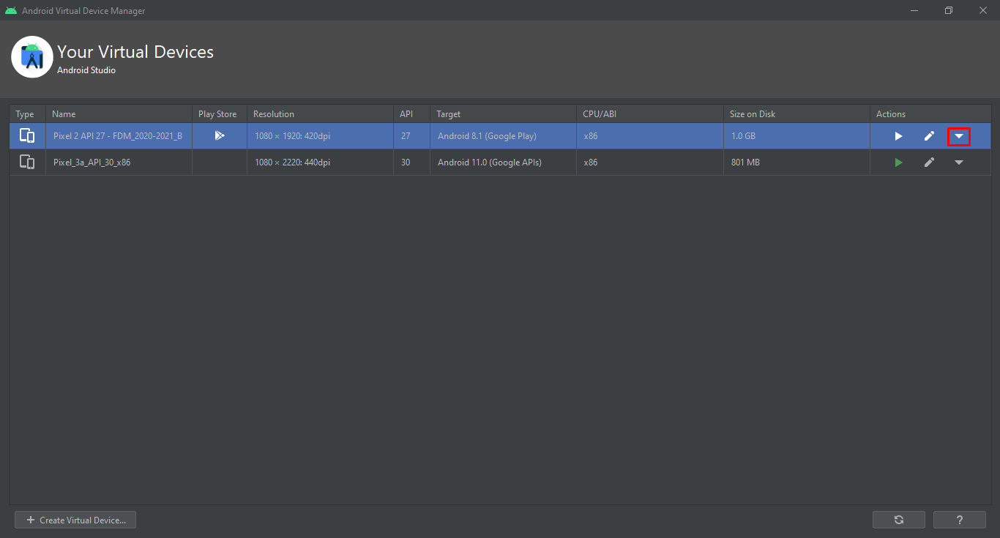
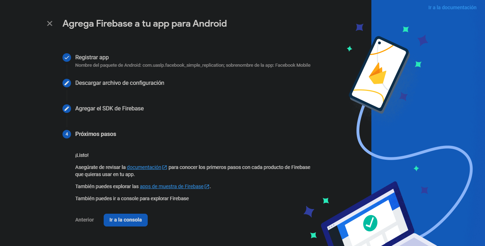

# **FUNDAMENTOS DESARROLLO MÓVIL: PROYECTO PARA FINAL DE SEMESTRE**

Este es el proyecto que se debió entregar para final del semestre.

> - Para esta actividad trabajaremos en equipo Germán y yo.
>
> Es el trabajo para fin de semestre.

## **_FECHA DE ENTREGA_**

> Viernes, 11 de junio del 2021, 5PM

### **FECHA EN QUE LO ENTREGAMOS**

> Lunes, 14 de JUNIO del 2021

## **REQUERIMIENTOS DE ENTREGA DE PROYECTO**

## **NOMBRE DEL PAQUETE DE LA APP**

El nombre del paquete de la app lo cambié para registrarlo con Firebase,
siguiendo la nomenclatura:

> com.company.appname
>
> - NOMBRE DEL PAQUETE:
>   - com.uaslp.facebook_simple_replication

## **_TABLA DE CONTENIDOS_**

- [1. **_FECHA DE ENTREGA_**](#11-fecha-de-entrega)
- [2. **NOMBRE DEL PAQUETE DE LA APP**](#12-nombre-del-paquete-de-la-app)
- [4. **PANTALLAS OBJETIVO**](#14-pantallas-objetivo)
- [5. **RESULTADOS DE LAS PANTALLAS**](#15-resultados-de-las-pantallas)
- [6. DOCUMENTACIÓN AUTOMÁTICA CON **_`dartdoc`_**](#16-documentación-automática-con-dartdoc)
- [7. **INSTALACIONES**](#17-instalaciones)
  - [7.1. **Android Studio**](#171-android-studio)
    - [7.1.1. **CONFIGURACIÓN OBLIGATORIA ANDROID STUDIO**](#1711-configuración-obligatoria-android-studio)
      - [7.1.1.1. **INSTALACIÓN DE PAQUETES**](#17111-instalación-de-paquetes)
      - [7.1.1.2. **INSTALACIÓN DE PLUGINS**](#17112-instalación-de-plugins)
      - [7.1.1.3. **COMPROBACIÓN DE ACTUALIZACIONES**](#17113-comprobación-de-actualizaciones)
    - [7.1.2. **CREAR UN `EMULADOR DE ANDROID` (`ANDROID VIRTUAL DEVICE`)**](#1712-crear-un-emulador-de-android-android-virtual-device)
      - [7.1.2.1. **_RECOMENDACIÓN IMPORTANTE PARA EL AVD_**](#17121-recomendación-importante-para-el-avd)
  - [7.2. **Flutter**](#172-flutter)
    - [7.2.1. **_EN QUÉ DIRECTORIO COLOCAR FLUTTER_**](#1721-en-qué-directorio-colocar-flutter)
    - [7.2.2. **FLUTTER** **_`SOUND NULL SAFETY`_**](#1722-flutter-sound-null-safety)
    - [7.2.3. **VARIABLE DE USUARIO**](#1723-variable-de-usuario)
  - [7.3. **Chocolatey**](#173-chocolatey)
    - [7.3.1. **_INSTRUCCIONES INSTALACIÓN DESDE POWERSHELL_**](#1731-instrucciones-instalación-desde-powershell)
  - [7.4. **scrcpy**](#174-scrcpy)
    - [7.4.1. **_INSTRUCCIONES INSTALACIÓN DESDE POWERSHELL con CHOCOLATEY_**](#1741-instrucciones-instalación-desde-powershell-con-chocolatey)
  - [7.5. **JAVA**](#175-java)
    - [7.5.1. **_INFORMACIÓN SOBRE LAS VERSIONES DE JAVA_**](#1751-información-sobre-las-versiones-de-java)
    - [7.5.2. **CONCEPTOS EN LOS ACRÓNIMOS DE JAVA:** **_`JDK, JVM, JRE`_**](#1752-conceptos-en-los-acrónimos-de-java-jdk-jvm-jre)
    - [7.5.3. **DESCARGA DE JAVA**](#1753-descarga-de-java)
- [8. **_VARIABLES DEL SISTEMA o de USUARIO_**](#18-variables-del-sistema-o-de-usuario)
  - [8.1. **ACCEDER A LA SECCIÓN PARA EDITAR LAS VARIABLES**](#181-acceder-a-la-sección-para-editar-las-variables)
  - [8.2. **VARIABLE DEL SISTEMA: `JAVA_HOME`**](#182-variable-del-sistema-java_home)
    - [8.2.1. VERIFICACIÓN DE QUE JAVA_HOME ESTÁ ESTABLECIDO](#1821-verificación-de-que-java_home-está-establecido)
    - [8.2.2. OTRAS VARIABLES DE USUARIO PARA FLUTTER y DART](#1822-otras-variables-de-usuario-para-flutter-y-dart)
- [9. FIREBASE](#19-firebase)
  - [9.1. SCREENSHOTS CONFIGURACIÓN FIREBASE](#191-screenshots-configuración-firebase)
  - [9.2. AGREGAR LAS SIGUIENTES LÍNEAS](#192-agregar-las-siguientes-líneas)
- [10. RECURSOS DE FACEBOOK APP (SVG, ÍCONOS, ...)](#110-recursos-de-facebook-app-svg-íconos-)
  - [10.1. LOGO DE FACEBOOK](#1101-logo-de-facebook)
  - [10.2. **REACCIONES DE FACEBOOK**](#1102-reacciones-de-facebook)
  - [10.3. USO DE ÍCONOS](#1103-uso-de-íconos)
    - [10.3.1. GOOGLE FONTS | MATERIAL ICONS](#11031-google-fonts--material-icons)
      - [10.3.1.1. Íconos que podríamos utilizar](#110311-íconos-que-podríamos-utilizar)
    - [10.3.2. **Íconos con Font Awesome**](#11032-íconos-con-font-awesome)
      - [10.3.2.1. **Íconos que podríamos utilizar**](#110321-íconos-que-podríamos-utilizar)
- [11. **_ENLACES EXTRA QUE FUERON ÚTILES_**](#111-enlaces-extra-que-fueron-útiles)

## 1.4. **PANTALLAS OBJETIVO**

Hay dos pantallas que tenemos como objetivo, pero una es opcional: pantalla de
inicio de sesión, y pantalla después de dar click al botón de inicio de sesión.

- P**antalla principal de inicio de sesión (los colores se modificaron al exportar
  desde Photoshop, ya que le quité la imagen original).**

  | NÚMERO DE PANTALLA |                                                                                             DESCRIPCIÓN DE PANTALLA                                                                                              |           IMAGEN DE LA PANTALLA            |
  | :----------------: | :--------------------------------------------------------------------------------------------------------------------------------------------------------------------------------------------------------------: | :----------------------------------------: |
  |         1          |                                                                         PRIMERA PANTALLA DE INICIO DE SESIÓN CON LOS COLORES MODIFICADOS                                                                         |  ![1 - MAIN LOGIN SCREEN - PICTURE GONE]   |
  |         1          |                                                                          COLORES ORIGINALES DE LA PRIMERA PANTALLA DE INICIO DE SESIÓN                                                                           | ![1 - MAIN LOGIN SCREEN - ORIGINAL COLORS] |
  |         2          |                                                              PANTALLA PARA INICIAR SESIÓN DESPUÉS DE DAR CLICK AL BOTÓN "Log Into Another Account"                                                               |     ![2 - LOGIN AFTER CLICKING BUTTON]     |
  |         3          | FEED PRINCIPAL DESPUÉS DE HABER INICIADO SESIÓN (LOS ELEMENTOS SON IMPRECISOS RESPECTO A POSICIÓN Y TAMAÑO PORQUE LA IMAGEN FUE EDITADA PARA OCULTAR INFORMACIÓN PERSONAL. NOS BASAMOS EN LA IMAGEN SIN EDITAR.) |      ![3 - MAIN FEED - EDITED IMAGE]       |

[1 - main login screen - picture gone]: objective-program-screens/LOGIN_SCREENS/1_main-login-with-picture_PICTURE-GONE_MODIFIED-COLORS-PS.png "1 | MAIN LOGIN SCREEN | PICTURE GONE"
[1 - main login screen - original colors]: objective-program-screens/LOGIN_SCREENS/1_main-login-with-picture_ORIGINAL-COLORS.png "1 | MAIN LOGIN SCREEN | ORIGINAL COLORS"
[2 - login after clicking button]: objective-program-screens/LOGIN_SCREENS/2_login-into-account-clicked_NO-NUMBER.png "2 | LOGIN AFTER CLICKING BUTTON"
[3 - main feed - edited image]: objective-program-screens/MAIN_FEED_SCREENS/main-feed_screen_1_EDITADA-SIN-DATOS-PERSONALES.png "3 | MAIN FEED | EDITED IMAGE"

## 1.5. **RESULTADOS DE LAS PANTALLAS**

Todas las pantallas que se muestran son del programa ejecutándose en un emulador
de **Android 11** en **Google Pixel 3**. Son varias columnas en la imagen para
que no se vean tan grandes.

| NÚMERO DE PANTALLA |                                               DESCRIPCIÓN DE PANTALLA                                               |            IMAGEN 1             |            IMAGEN 2             |            IMAGEN 3             |
| :----------------: | :-----------------------------------------------------------------------------------------------------------------: | :-----------------------------: | :-----------------------------: | :-----------------------------: |
|         1          |                                   Pantalla prinicipal: Login y datos de usuario.                                    |  ![1 - own main login screen]   |  ![2 - own main login screen]   |  ![3 - own main login screen]   |
|         1          |                                   Pantalla prinicipal: Login y datos de usuario.                                    |  ![4 - own main login screen]   |  ![5 - own main login screen]   |  ![6 - own main login screen]   |
|         1          |                                   Pantalla prinicipal: Login y datos de usuario.                                    |  ![7 - own main login screen]   |  ![8 - own main login screen]   |  ![9 - own main login screen]   |
|         1          |                                   Pantalla prinicipal: Login y datos de usuario.                                    |  ![10 - own main login screen]  |  ![11 - own main login screen]  |  ![12 - own main login screen]  |
|         1          |                                   Pantalla prinicipal: Login y datos de usuario.                                    |  ![13 - own main login screen]  |  ![14 - own main login screen]  |  ![15 - own main login screen]  |
|         -          |                                                          -                                                          |                -                |                -                |                -                |
|         2          |                                Segunda pantalla: Login : Input de datos de usuario.                                 | ![1 - own second login screen]  | ![2 - own second login screen]  | ![3 - own second login screen]  |
|         2          |                                Segunda pantalla: Login : Input de datos de usuario.                                 | ![4 - own second login screen]  | ![5 - own second login screen]  | ![6 - own second login screen]  |
|         2          |                                Segunda pantalla: Login : Input de datos de usuario.                                 | ![7 - own second login screen]  | ![8 - own second login screen]  | ![9 - own second login screen]  |
|         2          |                                Segunda pantalla: Login : Input de datos de usuario.                                 | ![10 - own second login screen] | ![11 - own second login screen] | ![12 - own second login screen] |
|         2          |                                Segunda pantalla: Login : Input de datos de usuario.                                 | ![13 - own second login screen] | ![14 - own second login screen] | ![15 - own second login screen] |
|         2          |                                Segunda pantalla: Login : Input de datos de usuario.                                 | ![16 - own second login screen] |                -                |                -                |
|         -          |                                                          -                                                          |                -                |                -                |                -                |
|         3          | Tercera y última pantalla: Feed principal -> Crear publicación, ver usuarios conectados, historias y publicaciones. |   ![1 - own main feed screen]   |   ![2 - own main feed screen]   |   ![3 - own main feed screen]   |
|         3          | Tercera y última pantalla: Feed principal -> Crear publicación, ver usuarios conectados, historias y publicaciones. |   ![4 - own main feed screen]   |   ![5 - own main feed screen]   |   ![6 - own main feed screen]   |
|         3          | Tercera y última pantalla: Feed principal -> Crear publicación, ver usuarios conectados, historias y publicaciones. |   ![7 - own main feed screen]   |   ![8 - own main feed screen]   |   ![9 - own main feed screen]   |
|         3          | Tercera y última pantalla: Feed principal -> Crear publicación, ver usuarios conectados, historias y publicaciones. |  ![10 - own main feed screen]   |  ![11 - own main feed screen]   |  ![12 - own main feed screen]   |
|         3          | Tercera y última pantalla: Feed principal -> Crear publicación, ver usuarios conectados, historias y publicaciones. |  ![13 - own main feed screen]   |  ![14 - own main feed screen]   |  ![15 - own main feed screen]   |
|         3          | Tercera y última pantalla: Feed principal -> Crear publicación, ver usuarios conectados, historias y publicaciones. |  ![16 - own main feed screen]   |  ![17 - own main feed screen]   |  ![18 - own main feed screen]   |
|         3          | Tercera y última pantalla: Feed principal -> Crear publicación, ver usuarios conectados, historias y publicaciones. |  ![19 - own main feed screen]   |  ![20 - own main feed screen]   |  ![21 - own main feed screen]   |
|         3          | Tercera y última pantalla: Feed principal -> Crear publicación, ver usuarios conectados, historias y publicaciones. |  ![22 - own main feed screen]   |  ![23 - own main feed screen]   |  ![24 - own main feed screen]   |
|         3          | Tercera y última pantalla: Feed principal -> Crear publicación, ver usuarios conectados, historias y publicaciones. |  ![25 - own main feed screen]   |  ![26 - own main feed screen]   |  ![27 - own main feed screen]   |
|         3          | Tercera y última pantalla: Feed principal -> Crear publicación, ver usuarios conectados, historias y publicaciones. |  ![28 - own main feed screen]   |                -                |                -                |

[//]: <IMÁGENES DE LA PRIMERA PANTALLA>
[1 - own main login screen]: VIDEOS_SS_PROGRESS/Pixel_3-ANDROID_11/FINALES/Login_1/1.png "1 - OWN MAIN LOGIN SCREEN"
[2 - own main login screen]: VIDEOS_SS_PROGRESS/Pixel_3-ANDROID_11/FINALES/Login_1/2.png "2 - OWN MAIN LOGIN SCREEN"
[3 - own main login screen]: VIDEOS_SS_PROGRESS/Pixel_3-ANDROID_11/FINALES/Login_1/3.png "3 - OWN MAIN LOGIN SCREEN"
[4 - own main login screen]: VIDEOS_SS_PROGRESS/Pixel_3-ANDROID_11/FINALES/Login_1/4.png "4 - OWN MAIN LOGIN SCREEN"
[5 - own main login screen]: VIDEOS_SS_PROGRESS/Pixel_3-ANDROID_11/FINALES/Login_1/5.png "5 - OWN MAIN LOGIN SCREEN"
[6 - own main login screen]: VIDEOS_SS_PROGRESS/Pixel_3-ANDROID_11/FINALES/Login_1/6.png "6 - OWN MAIN LOGIN SCREEN"
[7 - own main login screen]: VIDEOS_SS_PROGRESS/Pixel_3-ANDROID_11/FINALES/Login_1/7.png "7 - OWN MAIN LOGIN SCREEN"
[8 - own main login screen]: VIDEOS_SS_PROGRESS/Pixel_3-ANDROID_11/FINALES/Login_1/8.png "8 - OWN MAIN LOGIN SCREEN"
[9 - own main login screen]: VIDEOS_SS_PROGRESS/Pixel_3-ANDROID_11/FINALES/Login_1/9.png "9 - OWN MAIN LOGIN SCREEN"
[10 - own main login screen]: VIDEOS_SS_PROGRESS/Pixel_3-ANDROID_11/FINALES/Login_1/10.png "10 - OWN MAIN LOGIN SCREEN"
[11 - own main login screen]: VIDEOS_SS_PROGRESS/Pixel_3-ANDROID_11/FINALES/Login_1/11.png "11 - OWN MAIN LOGIN SCREEN"
[12 - own main login screen]: VIDEOS_SS_PROGRESS/Pixel_3-ANDROID_11/FINALES/Login_1/12.png "12 - OWN MAIN LOGIN SCREEN"
[13 - own main login screen]: VIDEOS_SS_PROGRESS/Pixel_3-ANDROID_11/FINALES/Login_1/13.png "13 - OWN MAIN LOGIN SCREEN"
[14 - own main login screen]: VIDEOS_SS_PROGRESS/Pixel_3-ANDROID_11/FINALES/Login_1/14.png "14 - OWN MAIN LOGIN SCREEN"
[15 - own main login screen]: VIDEOS_SS_PROGRESS/Pixel_3-ANDROID_11/FINALES/Login_1/15.png "15 - OWN MAIN LOGIN SCREEN"
[//]: <IMÁGENES SEGUNDA PANTALLA>
[1 - own second login screen]: VIDEOS_SS_PROGRESS/Pixel_3-ANDROID_11/FINALES/Login_2/1.png "1 - OWN SECOND LOGIN SCREEN"
[2 - own second login screen]: VIDEOS_SS_PROGRESS/Pixel_3-ANDROID_11/FINALES/Login_2/2.png "2 - OWN SECOND LOGIN SCREEN"
[3 - own second login screen]: VIDEOS_SS_PROGRESS/Pixel_3-ANDROID_11/FINALES/Login_2/3.png "3 - OWN SECOND LOGIN SCREEN"
[4 - own second login screen]: VIDEOS_SS_PROGRESS/Pixel_3-ANDROID_11/FINALES/Login_2/4.png "4 - OWN SECOND LOGIN SCREEN"
[5 - own second login screen]: VIDEOS_SS_PROGRESS/Pixel_3-ANDROID_11/FINALES/Login_2/5.png "5 - OWN SECOND LOGIN SCREEN"
[6 - own second login screen]: VIDEOS_SS_PROGRESS/Pixel_3-ANDROID_11/FINALES/Login_2/6.png "6 - OWN SECOND LOGIN SCREEN"
[7 - own second login screen]: VIDEOS_SS_PROGRESS/Pixel_3-ANDROID_11/FINALES/Login_2/7.png "7 - OWN SECOND LOGIN SCREEN"
[8 - own second login screen]: VIDEOS_SS_PROGRESS/Pixel_3-ANDROID_11/FINALES/Login_2/8.png "8 - OWN SECOND LOGIN SCREEN"
[9 - own second login screen]: VIDEOS_SS_PROGRESS/Pixel_3-ANDROID_11/FINALES/Login_2/9.png "9 - OWN SECOND LOGIN SCREEN"
[10 - own second login screen]: VIDEOS_SS_PROGRESS/Pixel_3-ANDROID_11/FINALES/Login_2/10.png "10 - OWN SECOND LOGIN SCREEN"
[11 - own second login screen]: VIDEOS_SS_PROGRESS/Pixel_3-ANDROID_11/FINALES/Login_2/11.png "11 - OWN SECOND LOGIN SCREEN"
[12 - own second login screen]: VIDEOS_SS_PROGRESS/Pixel_3-ANDROID_11/FINALES/Login_2/12.png "12 - OWN SECOND LOGIN SCREEN"
[13 - own second login screen]: VIDEOS_SS_PROGRESS/Pixel_3-ANDROID_11/FINALES/Login_2/13.png "13 - OWN SECOND LOGIN SCREEN"
[14 - own second login screen]: VIDEOS_SS_PROGRESS/Pixel_3-ANDROID_11/FINALES/Login_2/14.png "14 - OWN SECOND LOGIN SCREEN"
[15 - own second login screen]: VIDEOS_SS_PROGRESS/Pixel_3-ANDROID_11/FINALES/Login_2/15.png "15 - OWN SECOND LOGIN SCREEN"
[16 - own second login screen]: VIDEOS_SS_PROGRESS/Pixel_3-ANDROID_11/FINALES/Login_2/16.png "16 - OWN SECOND LOGIN SCREEN"
[//]: <IMÁGENES TERCERA PANTALLA>
[1 - own main feed screen]: VIDEOS_SS_PROGRESS/Pixel_3-ANDROID_11/FINALES/HomeScreen/1.png "1 - OWN MAIN FEED SCREEN"
[2 - own main feed screen]: VIDEOS_SS_PROGRESS/Pixel_3-ANDROID_11/FINALES/HomeScreen/2.png "2 - OWN MAIN FEED SCREEN"
[3 - own main feed screen]: VIDEOS_SS_PROGRESS/Pixel_3-ANDROID_11/FINALES/HomeScreen/3.png "3 - OWN MAIN FEED SCREEN"
[4 - own main feed screen]: VIDEOS_SS_PROGRESS/Pixel_3-ANDROID_11/FINALES/HomeScreen/4.png "4 - OWN MAIN FEED SCREEN"
[5 - own main feed screen]: VIDEOS_SS_PROGRESS/Pixel_3-ANDROID_11/FINALES/HomeScreen/5.png "5 - OWN MAIN FEED SCREEN"
[6 - own main feed screen]: VIDEOS_SS_PROGRESS/Pixel_3-ANDROID_11/FINALES/HomeScreen/6.png "6 - OWN MAIN FEED SCREEN"
[7 - own main feed screen]: VIDEOS_SS_PROGRESS/Pixel_3-ANDROID_11/FINALES/HomeScreen/7.png "7 - OWN MAIN FEED SCREEN"
[8 - own main feed screen]: VIDEOS_SS_PROGRESS/Pixel_3-ANDROID_11/FINALES/HomeScreen/8.png "8 - OWN MAIN FEED SCREEN"
[9 - own main feed screen]: VIDEOS_SS_PROGRESS/Pixel_3-ANDROID_11/FINALES/HomeScreen/9.png "9 - OWN MAIN FEED SCREEN"
[10 - own main feed screen]: VIDEOS_SS_PROGRESS/Pixel_3-ANDROID_11/FINALES/HomeScreen/10.png "10 - OWN MAIN FEED SCREEN"
[11 - own main feed screen]: VIDEOS_SS_PROGRESS/Pixel_3-ANDROID_11/FINALES/HomeScreen/11.png "11 - OWN MAIN FEED SCREEN"
[12 - own main feed screen]: VIDEOS_SS_PROGRESS/Pixel_3-ANDROID_11/FINALES/HomeScreen/12.png "12 - OWN MAIN FEED SCREEN"
[13 - own main feed screen]: VIDEOS_SS_PROGRESS/Pixel_3-ANDROID_11/FINALES/HomeScreen/13.png "13 - OWN MAIN FEED SCREEN"
[14 - own main feed screen]: VIDEOS_SS_PROGRESS/Pixel_3-ANDROID_11/FINALES/HomeScreen/14.png "14 - OWN MAIN FEED SCREEN"
[15 - own main feed screen]: VIDEOS_SS_PROGRESS/Pixel_3-ANDROID_11/FINALES/HomeScreen/15.png "15 - OWN MAIN FEED SCREEN"
[16 - own main feed screen]: VIDEOS_SS_PROGRESS/Pixel_3-ANDROID_11/FINALES/HomeScreen/16.png "16 - OWN MAIN FEED SCREEN"
[17 - own main feed screen]: VIDEOS_SS_PROGRESS/Pixel_3-ANDROID_11/FINALES/HomeScreen/17.png "17 - OWN MAIN FEED SCREEN"
[18 - own main feed screen]: VIDEOS_SS_PROGRESS/Pixel_3-ANDROID_11/FINALES/HomeScreen/18.png "18 - OWN MAIN FEED SCREEN"
[19 - own main feed screen]: VIDEOS_SS_PROGRESS/Pixel_3-ANDROID_11/FINALES/HomeScreen/19.png "19 - OWN MAIN FEED SCREEN"
[20 - own main feed screen]: VIDEOS_SS_PROGRESS/Pixel_3-ANDROID_11/FINALES/HomeScreen/20.png "20 - OWN MAIN FEED SCREEN"
[21 - own main feed screen]: VIDEOS_SS_PROGRESS/Pixel_3-ANDROID_11/FINALES/HomeScreen/21.png "21 - OWN MAIN FEED SCREEN"
[22 - own main feed screen]: VIDEOS_SS_PROGRESS/Pixel_3-ANDROID_11/FINALES/HomeScreen/22.png "22 - OWN MAIN FEED SCREEN"
[23 - own main feed screen]: VIDEOS_SS_PROGRESS/Pixel_3-ANDROID_11/FINALES/HomeScreen/23.png "23 - OWN MAIN FEED SCREEN"
[24 - own main feed screen]: VIDEOS_SS_PROGRESS/Pixel_3-ANDROID_11/FINALES/HomeScreen/24.png "24 - OWN MAIN FEED SCREEN"
[25 - own main feed screen]: VIDEOS_SS_PROGRESS/Pixel_3-ANDROID_11/FINALES/HomeScreen/25.png "25 - OWN MAIN FEED SCREEN"
[26 - own main feed screen]: VIDEOS_SS_PROGRESS/Pixel_3-ANDROID_11/FINALES/HomeScreen/26.png "26 - OWN MAIN FEED SCREEN"
[27 - own main feed screen]: VIDEOS_SS_PROGRESS/Pixel_3-ANDROID_11/FINALES/HomeScreen/27.png "27 - OWN MAIN FEED SCREEN"
[28 - own main feed screen]: VIDEOS_SS_PROGRESS/Pixel_3-ANDROID_11/FINALES/HomeScreen/28.png "28 - OWN MAIN FEED SCREEN"

## **1.6. DOCUMENTACIÓN AUTOMÁTICA CON _`dartdoc`_**

En dart, gracias a un comando llamado **_`dartdoc`_**, es posible generar la
documentación de **_`Dart`_** y **_`Flutter`_** de forma automática, pero hay que
seguir ciertos pasos:

1. Hay que establecer la siguiente variable de usuario en **`Path`**:

   - **`C:\SDKs\flutter\bin\cache\dart-sdk\bin`**

2. Hay que seguir una convención de comentarios específica para que se generen
   descripciones en los elementos de la documentación. Estas convenciones se
   encuentran definidas en [**Effective Dart: Documentation**](https://dart.dev/guides/language/effective-dart/documentation "Dart / Docs / Effective Dart: Documentation"),
   en donde lo más importante es lo siguiente:

   - Los comentarios deben de iniciar con **3 backslashes (\\\\\\)** si queremos
     que aparezca el texto en la documentación. Si lo hacemos con 2 (\\\\), no
     saldrá.

   - Podemos agregar descripciones de archivos, clases, atributos, funciones,
     y no estoy seguro de si se puede de más cosas, pero eso se puede
     encontrar en la misma documentación.

   - Hay ciertas convenciones para que estén estructurados de una mejor forma
     (según [**Effective Dart: Documentation**](https://dart.dev/guides/language/effective-dart/documentation "Dart / Docs / Effective Dart: Documentation")),
     por lo que si quieres saber más al respecto, tendrás que revisar la
     documentación oficial.

3. Entrar al directorio inicial de tu aplicación.

   ```properties
    cd carpeta_prinicipal_app_flutter
   ```

   > Dentro podrás encontrar (entre otros más) los siguientes directorios:
   >
   > - **`android/`**
   > - **`build/`**
   > - **`ios/`**
   > - **`lib/`**

4. Ejecutar el siguiente comando para activar **_`dartdoc`_**:

```properties
flutter pub global activate dartdoc
```

5. Ejecutar el siguiente comando para generar la documentación:

   ```properties
   dartdoc
   ```

6. Una vez realizados los pasos anteriores, encontraremos la documentación en
   formato **_`html`_** junto con más documentos en el siguiente directorio:

   > > **`carpeta_prinicipal_app_flutter\doc\api\`**
   >
   > El archivo específico es el siguiente:
   >
   > > **`carpeta_prinicipal_app_flutter\doc\api\index.html`**

7. Para ver la documentación, solamente hay que abrir el archivo y se abrirá una
   ventana en nuestro navegador. El documento tiene enlaces a los elementos,
   además de la descripción de cada uno a los que le agregamos con los
   comentarios en el formato mencionado anteriormente (\\\\\\).

## 1.7. **INSTALACIONES**

Para que todo funcione correctamente, hay que instalar varias cosas:

### 1.7.1. **Android Studio**

Simplemente descarga el archivo que se encuentra en el enlace y ejecutalo.
Después podrás configurarlo como tú quieras.

#### 1.7.1.1. **CONFIGURACIÓN OBLIGATORIA ANDROID STUDIO**

Para que Android Studio y Flutter funcionen de manera correcta, hay que
configurar unos elementos que serán obligatorios, siguiendo los siguientes pasos:

##### 1.7.1.1.1. **INSTALACIÓN DE PAQUETES**

Hay una serie de paquetes necesarios para trabajar con Flutter y el emulador de
Android, entre otras cosas más.

1. Abre Android Studio.

   

2. Da click en el botón ⚙ **`Configure`**.

   

3. Abre la ventana de configuraciones del **`SDK (Software Developer Kit)`**
   dando click en el botón **`SDK Manager`**.

   

   - Te aparecerá una ventana con la lista de los **`Android SDK`**, los cuales te
     permitirán desarrollar aplicaciones en ese sistema operativo.

     

4. De la lista de **`SDK Platforms`** puedes elegir el que quieras, pero en mi
   caso tuve que eleguir el **`Android 8.1 (Oreo) | API Level: 27`** porque el
   profesor así lo indicó por su estabilidad.

   ")

5. Ahora dirígete a la pestaña de **`SDK Tools`** dentro del mismo submenú. Está
   a la derecha de la pestaña del paso anterior (**`SDK Platforms`**).

   

6. **Tendrás que seleccionar una serie de elementos** (**_sin quitar la selección de
   los seleccionados por default_**) que te permitirán trabajar con
   el desarrollo de tus aplicaciones y el uso del **_`emulador de Android`_**.
   Estos elementos son los siguientes:

   - **Google USB Driver**

     

   - **_El siguiente elemento depende de tu procesador_**:

     - **_Si tienes un procesador de Intel, selecciona la siguiente opción_**:

       > **Intel x86 Emulator Accelerator (HAXM Installer)**

     - **_Si tienes un procesador de AMD, selecciona la siguiente opción_**:

       > **Android Emulator Hypervisor Driver for AMD Processors (installer)**

     

   - [***`OPCIONAL POR SI QUIERES LA ÚLTIMA VERSION (NO ESTABLE) DE ESTE
     ELEMENTO`***]
     **Android SDK Build-Tools 31-rc3** (**_YO NO LA SELECCIONARÉ, A MENOS QUE
     TENGA PROBLEMAS CON LA ÚLTIMA VERSIÓN ESTABLE_**)

     1. Da click en el botón de la parte inferior derecha que dice
        "**_`Show Package Details`_**" para mostrar TODAS las versiones de cada
        paquete.

     2. Da click en la última versión del paquete, la cual puede estar hasta
        o hasta abajo de la lista, dependiendo del orden en el que estén
        mostrados. Es la versión con los números más altos.

     

   - [***`OPCIONAL POR SI QUIERES PODER UTILIZAR LA LÍNEA DE COMANDOS`***]
     **Android SDK Command-line Tools (latest)**

     ")

7. Ahora, para que todo sea instalado, da click en el botón "**_`Apply`_**".

   

8. Aparecerá una ventana que te pedirá confirmar los cambios. Da click en el
   botón "**_`OK`_**".

   

9. Aparecerá otra ventana en donde tendrás que aceptar los términos y
   condiciones de cada licencia. Acéptalos y da click al botón "**_`Finish`_**".

   

10. Después de esto, te mostrará el progreso de instalación de los paquetes.


11. Una vez terminada la instalación, da click en el botón "**_`Finish`_**".

    

12. Ahora da click en el botón "**_`OK`_**".


##### 1.7.1.1.2. **INSTALACIÓN DE PLUGINS**

Para trabajar con Flutter de forma cómoda, hay que instalar una serie de Plugins
que nos facilitarán el desarrollo de los programas.

1. Abre Android Studio.

   

2. Da click en el botón ⚙ **`Configure`**.

   

3. Da click en el botón "**_`Plugins`_**".

   

4. Te aparecerá una nueva ventana. Selecciona el apartado de
   "**_`Marketplace`_**".

   

5. Busca "**`Flutter`**", seleccionalo y da click en "**_`Install`_**".

   

6. Te indicará que también tienes que instalar el plugin de "**_`Dart`_**". Da
   click en "**_`Install`_**", ya que **_`Flutter` se escribe en `Dart`_**, por lo que es
   necesario.

   

7. Si es que te lo pide, da click en "**`Restart IDE`**" para que se apliquen
   los cambios.

   

##### 1.7.1.1.3. **COMPROBACIÓN DE ACTUALIZACIONES**

Hay que comprobar si hay actualizaciones disponibles.

1. Abre Android Studio.

   

2. Da click en el botón ⚙ **`Configure`**.

   

3. Da click en el botón "**_`Check for Updates`_**".

   

   - Si hay actualizaciones te lo indicará como en la siguiente captura. Da
     click a ese botón/hipervínculo.

     

4. Te aparecerá una nueva ventana. Da click a "**_`Update`_**" de forma
   individual si solo quieres actualizar elementos en específico, o da click en
   "Update all" si quieres que todos los paquetes se actualicen automáticamente.

   
   

5. Si es que te lo pide, da click en "**`Restart IDE`**" para que se apliquen
   los cambios.

   

   

6. Listo.

#### 1.7.1.2. **CREAR UN `EMULADOR DE ANDROID` (`ANDROID VIRTUAL DEVICE`)**

Para correr un programa podemos utilizar nuestro celular conectándolo a a la
computadora mediante cable USB, o mediante un emulador de Android creado con
Android Studio.

1. Abre Android Studio.

   

2. Da click en el botón ⚙ **`Configure`**.

   

3. Da click en la opción de **`AVD Manager`**.

   

   - Se abrirá una nueva ventana "**`Your Virtual Devices`**", en donde se
     encontrará una lista de dispositivos virtuales (emuladores de android).

     

4. Da click en **`Create Virtual Device`**.

   

5. Aparecerá una nueva ventana: **`Virtual Device Configuration`**. Elige el
   dispositivo que quieras emular. En mi caso elegí el **`Pixel 2`**, que es el
   que recomendó el profesor. Después das click en el botón **`Next`**.

   

6. Selecciona el Sistema Operativo que quieres que emule el dispositivo virtual.
   En mi caso elegí **`Android 8.1 (Oreo) | API Level: 27`**.

   - Si no lo tienes descargado, lo tendrás que descargar dando click al
     **`Download`** que está a la derecha del nombre del Sistema Operativo.

      | Download")

    | Installing")

7. Una vez terminada la instalación del API que elegiste, da click en
   **`Finish`**.

   

8. Da click en **`Next`** después de elegir la API a utilizar.

   

9. Verifica tu configuración y cuando todo esté como lo deseas, da click en
   **`Finish`**.

   - En esta sección puedes cambiar el nombre del dispositivo y algunas
     configuraciones avanzadas.

   

10. Ya está todo listo. Ahora puedes iniciar tu dispositivo dando click en el
    botón verde bajo la sección "**`Actions`**".


##### 1.7.1.2.1. **_RECOMENDACIÓN IMPORTANTE PARA EL AVD_**

Cada vez, el AVD va a ir ocupando una mayor cantidad de espacio en el disco
duro, el cual se puede ver en la sección de "**`Size on Disk`**", así que viene
muy bien la liberación de ese espacio.


1. En la sección "**`Actions`**" da click al botón que tiene la flecha para
   abajo.

   

2. Da click a "**`Wipe Data`**".

   

3. Listo. Ahora has liberado una buen cantidad de espacio en el disco duro.
   Puedes hacer esto en cualquier momento (mientras no utilices el dispositivo).

### 1.7.2. **Flutter**

Entra al enlace de la documentación oficial de [Flutter] y en la sección de
**_"[Get the Flutter SDK]"_** da click en el botón de descarga, el cual dice
**_`flutter_windows_2.0.6-stable.zip`_**.

[get the flutter sdk]: https://flutter.dev/docs/get-started/install/windows#get-the-flutter-sdk "Flutter Windows Install | Get the Flutter SDK"

#### 1.7.2.1. **_EN QUÉ DIRECTORIO COLOCAR FLUTTER_**

Para no tener problemas con espacios y demás, coloqué Flutter directamente en el
directorio principal del disco duro (**`C:/`**), creando una carpeta dentro y
extrayéndolo. Entonces quedaría de la siguiente forma:

> **`C:\SDKs\flutter`**

Así, cada vez que quiera encontrar Flutter, será más sencillo.

#### 1.7.2.2. **FLUTTER** **_`SOUND NULL SAFETY`_**

> **_A día de hoy, Viernes, 21 de mayo del 2021, aún no lo implementamos, pero
> dejamos las instrucciones para un futuro._**

Habilitamos la opción `Sound Null Safety` de Flutter para evitar problemas con
valores null. Esto lo podemos encontrar en la documentación:

> [Dart | Samples & tutorials/Null Safety](https://dart.dev/null-safety#enable-null-safety "Dart | Samples & tutorials/Null Safety")

Como se indica en el sitio web:

**_To make Dart treat your code as null safe, the SDK constraints must_**
**_require a language version that has null safety support. For example, your_**
**_`pubspec.yaml` file might have the following constraints:_**

> ```yaml
> environment:
>   sdk: ">=2.12.0 <3.0.0"
> ```

Siguiendo lo anterior, `Sound null safety` estaría activado.

#### 1.7.2.3. **VARIABLE DE USUARIO**

Para ver cómo configurar la variable de usuario, dirígete a la **sección del
siguiente enlace** (te enviará dentro del README):

> [CONFIGURACIÓN DE VARIABLE DE USUARIO PARA FLUTTER](#flutter-user-var "VARIABLE DE USUARIO PARA FLUTTER")

### 1.7.3. **Chocolatey**

[Chocolatey] es un administrador de paquetes en Windows, con el que podemos
instalar una diversidad de paquetes (valga la redundancia) de forma sencilla
corriendo comandos desde una terminal.

> Este es solo para instalar [scrcpy]

#### 1.7.3.1. **_INSTRUCCIONES INSTALACIÓN DESDE POWERSHELL_**

De acuerdo con las instrucciones del sitio web de [Chocolatey], hay que seguir
los siguientes pasos:

> REQUIREMENTS
>
> - Windows 7+ / Windows Server 2003+
> - PowerShell v2+ (minimum is v3 for install from this website due to TLS 1.2
>   requirement)
> - .NET Framework 4+ (the installation will attempt to install .NET 4.0 if you do
>   not have it installed)(minimum is 4.5 for install from this website due to TLS
>   1.2 requirement)

1. First, ensure that you are using an
   [administrative shell](https://www.howtogeek.com/194041/how-to-open-the-command-prompt-as-administrator-in-windows-8.1/ "administrative shell") -
   you can also install as a non-admin, check out [Non-Administrative
   Installation](https://docs.chocolatey.org/en-us/choco/setup#non-administrative-install "Non-Administrative Installation").

2. Install with powershell.exe

   > **_NOTE:_ Please inspect [https://chocolatey.org/install.ps1](https://chocolatey.org/install.ps1 "https://chocolatey.org/install.ps1")
   > prior to running any of these scripts to ensure safety. We already know
   > it's safe, but you should verify the security and contents of any script
   > from the internet you are not familiar with. All of these scripts download
   > a remote PowerShell script and execute it on your machine. We take security
   > very seriously.
   > [Learn more about our security protocols](https://docs.chocolatey.org/en-us/information/security "Learn more about our security protocols")
   > .**

   With PowerShell, you must ensure [Get-ExecutionPolicy](https://go.microsoft.com/fwlink/?LinkID=135170 "Get-ExecutionPolicy")
   is not Restricted. We suggest using `Bypass` to bypass the policy to get
   things installed or `AllSigned` for quite a bit more security.

   - Run `Get-ExecutionPolicy`. If it returns `Restricted`, then run `Set-ExecutionPolicy AllSigned` or `Set-ExecutionPolicy Bypass -Scope Process`.

   Now run the following command:

   > ```ps
   > Set-ExecutionPolicy Bypass -Scope Process -Force; [System.Net.ServicePointManager]::SecurityProtocol = [System.Net.ServicePointManager]::SecurityProtocol -bor 3072; iex ((New-Object System.Net.WebClient).DownloadString('https://chocolatey.org/install.ps1'))
   > ```

3. Paste the copied text into your shell and press Enter.
4. Wait a few seconds for the command to complete.
5. If you don't see any errors, you are ready to use Chocolatey! Type `choco` or
   `choco -?` now, or see [Getting Started](https://docs.chocolatey.org/en-us/getting-started "Getting Started")
   for usage instructions.

   

   

### 1.7.4. **scrcpy**

[scrcpy] es una aplicación para poder ver la pantalla de tu celular en tu
computadora, conectándolo con un cable USB. Se puede instalar de diversas
formas, indicadas en el GitHub, al que puedes hacer dando click aquí: [scrcpy].

#### 1.7.4.1. **_INSTRUCCIONES INSTALACIÓN DESDE POWERSHELL con CHOCOLATEY_**

En mi caso, decidí instalarlo con [Chocolatey], ya que es más rápido y sencillo
que tener que descomprimir carpetas manualmente y cosas así.

Hay que ejecutar los siguientes comandos en la terminal de `Windows Powershell`,
que ya viene instalada en Windows 10.

> **NOTA**: Va a pedir que aceptes varias cosas, por lo que tendrás que hacerlo
> para que los programas se puedas descargar e instalar.
>
> - **`Y`** <- **Correr solo el script actual.**
> - **`A`** <- **Correr todos los scripts.**

1. Hay que instalar una cosa antes, para hacerlo funcionar, que es el `Android Debug Bridge (adb)`:

   > ```properties
   > choco install adb
   > ```

   

   

2. Ahora ya habría que instalar [scrpy] escribiendo lo siguiente:

   > ```properties
   > choco install scrcpy
   > ```

   

   

### 1.7.5. **JAVA**

Es necesario tener instalado Java y tenerlo en las variables del sistema para
poder ejecutar los programas.

#### 1.7.5.1. **_INFORMACIÓN SOBRE LAS VERSIONES DE JAVA_**

Hay diversas versiones de Java, por lo que hay que saber elegir cuál utilizar.
En el siguiente enlace esto viene bien explicado:

> - [stackchief | Which Version of Java Should You Use?]

#### 1.7.5.2. **CONCEPTOS EN LOS ACRÓNIMOS DE JAVA:** **_`JDK, JVM, JRE`_**

Hay diversos acrónimos que se manejan en Java, por lo que identificar cuál
significa qué cosa es complicado.

La información para conocer esto la encontré en el siguiente enlace (mismo del
punto anterior):

> - [stackchief | Which Version of Java Should You Use?]
>
> - **`JDK: Java Developer Kit`**
>
>   The **`Java Developer Kit (JDK)`** is a development environment that you
>   download for developing Java applications. It includes the JRE as well as an
>   interpreter, compiler, and other tools for debugging and development. You'll
>   need the JDK to develop Java applications, but not to run them. This is
>   because the JRE is included with Java installs.
>
> - **`JVM: Java Virtual Machine`**
>
>   The **`Java Virtual Machine (JVM)`** which is an abstract computing machine
>   that enables your computer to run a Java program.
>
> - **`JRE: Java Runtime Environment`**
>
>   Java requires a runtime environment **to execute the code you write**. When
>   you download Java, you also get the **`Java Runtime Environment (JRE)`**.
>   This JRE includes a Java Virtual Machine (JVM) which is an abstract
>   computing machine that enables your computer to run a Java program.

[stackchief | which version of java should you use?]: https://www.stackchief.com/blog/Which%20Version%20of%20Java%20Should%20You%20Use%3F "stackchief | Which Version of Java Should You Use?"

#### 1.7.5.3. **DESCARGA DE JAVA**

En mi caso descargué la versión **`Java SE 11 (LTS)`**, ya que es la última
versión que se ha lanzado con **`LTS (Long Term Support - Soporte a largo plazo)`**, lo que significa que es una versión que tendrá soporte por mucho más
tiempo de lo habitual. Esto no debería se un problema y podría instalar la
última versión que se ha lanzado, la **`Java SE 16`**, pero por ahora instalaré
esta.

> - [TheServerSide | Don't ever put a non-Java LTS release into production](https://www.theserverside.com/opinion/Dont-ever-put-a-non-Java-LTS-release-into-production "TheServerSide | Don't ever put a non-Java LTS release into production")

Por lo que leí, la próxima versión de **`Java LTS`** será la versión **`17`**, y
llegará en este año 2021, pero a día de hoy, Mayo del 2021 aún no ha salido.
Cada versión de Java es lanzada cada 6 meses.

> **_ENLACE DE DESCARGA DE VERSIONES DE `JAVA SE (Standard Edition)`_**
>
> - [Oracle | Java SE Downloads | Java Platform, Standard Edition](https://www.oracle.com/mx/java/technologies/javase-downloads.html "Oracle | Java SE Downloads | Java Platform, Standard Edition")
>
> **_DESCARGAS DE `Java SE Development Kit (JDK) 11`_**
>
> - [Oracle | Java SE Development Kit 11 Downloads](https://www.oracle.com/mx/java/technologies/javase-jdk11-downloads.html "Oracle | Java SE Development Kit 11 Downloads")

- **_Descargué la versión de Windows:_**

| Product / File Description | File Size |            Download             |
| :------------------------: | :-------: | :-----------------------------: |
| **Windows x64 Installer**  | 152.05 MB | jdk-11.0.11_windows-x64_bin.exe |

> **_NOTA: REQUIERES TENER UNA CUENTA DE `ORACLE` PARA LA INSTALACIÓN._**
>
> - **_DIRECTORIO EN MI PC: `C:\Program Files\Java\jdk-11.0.11\`_**#

## 1.8. **_VARIABLES DEL SISTEMA o de USUARIO_**

Para que los programas funcionen de la mejor forma posible, hay que establecer
las variables del sistema que identifiquen a los programas. Esto se explicará
en esta sección.

Además, las variables del sistema permiten ejecutar ciertas instrucciones desde
la línea de comandos.

### 1.8.1. **ACCEDER A LA SECCIÓN PARA EDITAR LAS VARIABLES**

Para esto hay que seguir una serie de pasos que serán indicados a continuación.

1. Abre el buscador de Windows. Hay 2 formas de hacerlo.
   1. Presiona la lupa que está al lado del ícono de Windows en la barra de
      tareas.
   2. Presiona la combinación de teclas: **_`Windows + S`_**
2. Escribir en la barra lo siguiente: **`env`**.
3. Selecciona la opción: "**_`Editar las variables de entorno del sistema`_**".

   

   - Te aparecerá una ventana: **Propiedades del sistema**.

     

4. Selecciona el botón: "**`Variables de entorno...`**".

   

   - Te aparecerá una nueva ventana: "Variables de entorno", que muestra y da la
     opción de manipular todas las variables de usuario y del sistema.

     

5. En esta sección ya puedes modificar las **_variables de usuario o del
   sistema_** como lo requieras.

### 1.8.2. **VARIABLE DEL SISTEMA: `JAVA_HOME`**

Para poder ejecutar los programas necesitamos tener instalado `Java` y agregado a **_`JAVA_HOME`_**.

En el siguiene enlace están las instrucciones para establecer **_`JAVA_HOME`_**:

> - [Confluence Support | Setting the JAVA_HOME Variable in Windows](https://confluence.atlassian.com/doc/setting-the-java_home-variable-in-windows-8895.html "Confluence Support | Setting the JAVA_HOME Variable in Windows")

1. Accede a la ventana de **_"Variables del entorno"_** como indican los pasos
   del inicio de la sección.

   

2. En las **_`variables del sistema`_** da click en "**_`Nueva...`_**".

   

3. En el campo "**_`Nombre de la variable:`_**" ingresa lo siguiente:

   > JAVA_HOME

   

4. En el campo "**_`Valor de la variable:`_**" ingresa el directorio de
   instalación de tu JDK. En mi caso fue el siguiente (no lleva backslash "\\"
   al final):

   > C:\Program Files\Java\jdk-11.0.11

   

5. Da click en "**_`Aceptar`_**".

6. Listo, tu variable del sistema ya está establecida.

   

#### 1.8.2.1. VERIFICACIÓN DE QUE JAVA_HOME ESTÁ ESTABLECIDO

Hay que verificar que todo haya salido bien y el sistema identifica la variable
**_`JAVA_HOME`_**. Esto se logra ejecutando un comando después de haber
reiniciado cualquier terminal que haya abierta, ya que si no, las variables del
sistema no se actualizan, y si no hay efecto, entonces hay que reiniciar el
sistema.

El comando es el siguiente:

> ```properties
> java --version
> ```

Si todo se configuró correctamente, te mostrará un mensaje con tu versión
instalada de Java.


### **ANDROID STUDIO**

Para [Android Studio] solo hay una **_VARIABLE DE USUARIO_** que yo utilicé:

> - ANDROID_SDK_ROOT=C:\Users\\...\AppData\Local\Android\Sdk

### **FLUTTER**

Para que flutter sea reconocido en el sistema, hay que agregarlo a las
variables de usuario, [como es indicado en la documentación](https://flutter.dev/docs/get-started/install/windows#update-your-path "Flutter | Windows Install | Update your path").

En la sección de **variables de usuario** hay que revisar si ya hay una variable
llamada **`Path`**.

- Si no la hay, habrá que crearla.
- Si la hay, seguir los siguientes pasos:

  1. Dar click en la variable **`Path`**.
  2. Dar click en el botón **"`Editar...`"**.
  3. Dar click en el botón **"`Nuevo`"**.
  4. En el campo agregar el directorio de **`flutter\bin`** dependiendo de en
     dónde instalaste **`Flutter`**.

     > En mi caso puse lo siguiente en **`Path`**:
     >
     > - **_`C:\SDKs\flutter\bin`_**

#### 1.8.2.2. OTRAS VARIABLES DE USUARIO PARA FLUTTER y DART

Además, es necesario agregar otras **`variables de usuario`** para poder
trabajar bien con flutter, que son las siguientes:

- **`Path`**

  - **C:\SDKs\flutter\\.pub-cache\bin**
  - **C:\SDKs\flutter\bin\cache\dart-sdk\bin**

    > Esta variable de usuario es requerida para poder ejecutar **_`dartdoc`_**
    > desde la terminal.

- **`FLUTTER_ROOT`**

  - **C:\SDKs\flutter**

## 1.9. FIREBASE

Para poder utilizar Firebase se tuvieron que realizar algunas modificaciones
en algunos archivos, además de hacer la configuración en línea.

> - com.uaslp.facebook_simple_replication

### 1.9.1. SCREENSHOTS CONFIGURACIÓN FIREBASE




### 1.9.2. AGREGAR LAS SIGUIENTES LÍNEAS

De las instrucciones de **_Agrega Firebase a tu app para Android_**:

> 3. Agregar el SDK de Firebase
>
>    El complemento de Google Services para
>    [Gradle](https://gradle.org/ "https://gradle.org/") carga el archivo
>    google-services.json que acabas de descargar. Para usar el complemento, debes
>    modificar los archivos **_`build.gradle`_**.
>
>    **Archivo \***`build.gradle`**\* de nivel de proyecto**
>    (**_`<project>/build.gradle`_**):
>
>    ```gradle
>    buildscript {
>      repositories {
>        // Check that you have the following line (if not, add it):
>        google()  // Google's Maven repository
>      }
>      dependencies {
>        ...
>        // Add this line
>        classpath 'com.google.gms:google-services:4.3.8'
>      }
>    }
>
>    allprojects {
>      ...
>      repositories {
>        // Check that you have the following line (if not, add it):
>        google()  // Google's Maven repository
>        ...
>      }
>    }
>    ```
>
>    **Archivo \***`build.gradle`**\* de nivel de app**
>    (**_`<project>/<app-module>/build.gradle`_**):
>
>    ```gradle
>    apply plugin: 'com.android.application'
>    // Add this line
>    apply plugin: 'com.google.gms.google-services'
>
>    dependencies {
>      // Import the Firebase BoM
>      implementation platform('com.google.firebase:firebase-bom:28.0.1')
>
>      // Add the dependencies for the desired Firebase products
>      // https://firebase.google.com/docs/android/setup#available-libraries
>    }
>    ```
>
> Después de haber realizado estos pasos anteriores, utilizar el comando
> `flutter pacckages get` (equivalente a `flutter pub get`) para que quede todo
> actualizado, el cual es indicado en el siguiente sitio web:
>
> - [Firebase | Documentación | Firebase / Documentos / Información básica / Agrega Firebase a tu app de Flutter](https://firebase.google.com/docs/flutter/setup?platform=android#add-config-file "Firebase | Documentación | Firebase / Documentos / Información básica / Agrega Firebase a tu app de Flutter")

## 1.10. RECURSOS DE FACEBOOK APP (SVG, ÍCONOS, ...)

Para poder maquetar de forma más precisa las pantallas de la app de Facebook
para celulares, necesitamos diversos recursos, como los íconos de Facebook,
reacciones y demás.

En esta sección se encontrarán diversos enlaces, en los cuales se podrán
encontrar los recursos que utilizamos.

### 1.10.1. LOGO DE FACEBOOK

Los logos de Facebook los descargamos de la página oficial de los recursos
(assets):

> - [Brand Resources / Facebook App / “f” Logo](https://en.facebookbrand.com/facebookapp/assets/f-logo/?audience=landing "Brand Resources / Facebook App / “f” Logo")

Los logotipos descargados se encuentran en el siguiente directorio:

[Directorio con todos los logos descargados | assets/fb_official/logos/](facebook_login_screen_replication/assets/fb_official/logos/ "Directorio con todos los logos descargados | assets/fb_official/logos/")

> Los logos con la F blanca y el círculo azul, se encuentran en diversos
> directorios y con diversos tamaños, por lo que los listaré para encontrarlos
> con mayor facilidad y utilizar los que más nos convengan:
>
> - [Carpeta principal de los siguientes logos: assets/fb_official/logos/f_Logo_Online_04_2019/Color/PNG/](facebook_login_screen_replication/assets/fb_official/logos/f_Logo_Online_04_2019/Color/PNG/ "assets/fb_official/logos/f_Logo_Online_04_2019/Color/PNG/")
>
>   - 
>   - 
>   - 
>   - 
>   - 
>   - 
>   - 
>
> - [Carpeta principal de los siguientes logos: assets/fb_official/logos/f_Logo_TVFilm_04_2019/Color/](facebook_login_screen_replication/assets/fb_official/logos/f_Logo_TVFilm_04_2019/Color/ "Carpeta principal de los siguientes logos: assets/fb_official/logos/f_Logo_TVFilm_04_2019/Color/")
>
>   - 

### 1.10.2. **REACCIONES DE FACEBOOK**

Facebook tiene su propio sitio web en donde provee de estos íconos, pero se
tienen que seguir ciertas pautas para utilizarlos de forma que no se rompan las
normas de Facebook. El enlace es el siguiente:

> - [**_Brand Resources / Facebook App / Reactions_**](https://en.facebookbrand.com/facebookapp/assets/reactions/ "Brand Resources / Facebook App / Reactions")

El problema es que se descargan como una imagen en PNG y los necesitamos por
separado, por lo que recurrimos al siguiente enlace:

> - [iconscout | Facebook Reaction Icon Pack](https://iconscout.com/icon-pack/facebook-reactions-emoticons "iconscout | Facebook Reaction Icon Pack")

- **Y para poder renderizar y modificar los elementos en SVG podemos utilizar
  el siguiente paquete:**

  > - [pub.dev | flutter_svg 0.22.0](https://pub.dev/packages/flutter_svg "pub.dev | flutter_svg 0.22.0")

### 1.10.3. USO DE ÍCONOS

Podemos utilizar varios paquetes de íconos. En nuestro caso consideramos
Font Awesome y Material Design.

#### 1.10.3.1. GOOGLE FONTS | MATERIAL ICONS

> [Google Fonts | Material Icons](https://fonts.google.com/icons "Google Fonts | Material Icons")

##### 1.10.3.1.1. Íconos que podríamos utilizar

- [Facebook](https://fonts.google.com/icons?selected=Material%20Icons%20Outlined%3Afacebook "Facebook")
- [Search](https://fonts.google.com/icons?selected=Material%20Icons%20Outlined%3Asearch "Search")
- [Add](https://fonts.google.com/icons?selected=Material%20Icons%20Outlined%3Aadd "Add")
- [More Vert](https://fonts.google.com/icons?selected=Material%20Icons%20Outlined%3Amore_vert "https://fonts.google.com/icons?selected=Material%20Icons%20Outlined%3Amore_vert")
- [info_outlined](https://fonts.google.com/icons?selected=Material%20Icons%20Outlined%3Ainfo "info_outlined")

#### 1.10.3.2. **Íconos con Font Awesome**

Font Awesome, nos provee de una gran cantidad de elementos.

Utilizamos el paquete:

> [pub.dev | font_awesome_flutter 9.0.0](https://pub.dev/packages/font_awesome_flutter "font_awesome_flutter 9.0.0")

Para que funcione hay que agregar el nombre del paquete y la última versión
(9.0.0) a las dependencias del [pubspec.yaml](pubspec.yaml "pubspec.yaml").

##### 1.10.3.2.1. **Íconos que podríamos utilizar**

- [search](https://fontawesome.com/icons/search?style=solid "search")
  - El problema es que es más robusto que el de facebook.
  - El de Facebook parece ser el `LIGHT`, pero ese requiere versión `PRO`.
- [facebook](https://fontawesome.com/icons/facebook?style=brands "facebook")
- [plus](https://fontawesome.com/icons/plus?style=solid "plus")
  - También es algo robusto.
  - El de Facebook parece ser la versión `LIGHT`.
- [elipsis-v](https://fontawesome.com/icons/ellipsis-v?style=solid "elipsis-v")
  - También parece que la versión de Facebook es la `LIGHT` o la `PRO`.
- [info-circle](https://fontawesome.com/icons/info-circle?style=solid "info-circle")
  - **`LIGHT`**.

## 1.11. **_ENLACES EXTRA QUE FUERON ÚTILES_**

- [https://www.youtube.com/watch?v=d5PpeNb-dOY]()
- [https://stackoverflow.com/questions/50081213/how-do-i-use-hexadecimal-color-strings-in-flutter]()
- [https://www.tutorialspoint.com/dart_programming/dart_programming_map.htm]()
- [https://stackoverflow.com/questions/29182581/global-variables-in-dart]()
- [https://stackoverflow.com/questions/49541354/disable-defaultfocushighlightenabled-in-the-android-part-for-a-xamarin-forms-app]()

  - [https://github.com/flutter/flutter/issues/16810]()

- [https://aschilken.medium.com/flutter-best-practices-colors-and-textstyles-6e14b06fc3a1]()
- [https://stackoverflow.com/questions/52489458/how-to-change-status-bar-color-in-flutter]()
- [https://stackoverflow.com/questions/64873410/how-to-get-status-bar-height-in-flutter]()
  - [https://stackoverflow.com/questions/61969143/no-mediaquery-ancestor-could-be-found]()
- [https://stackoverflow.com/questions/50522237/flutter-circle-design/50524531]()
- [Stack Overflow | What is the Dart null checking idiom or best practice?](https://stackoverflow.com/questions/17006664/what-is-the-dart-null-checking-idiom-or-best-practice "Stack Overflow | What is the Dart null checking idiom or best practice?")
  - [Stack Overflow | What is the Dart null checking idiom or best practice? | atreeon's answer](https://stackoverflow.com/a/58027593/13562806 "Stack Overflow | What is the Dart null checking idiom or best practice? | atreeon's answer")
- [Stack Overflow | Button Width Match Parent](https://stackoverflow.com/questions/50014342/button-width-match-parent "Stack Overflow | Button Width Match Parent")
- [GitHub | Genymobile/scrcpy | Screenshot/Record Screen #21](https://github.com/Genymobile/scrcpy/issues/21 "GitHub | Genymobile/scrcpy | Screenshot/Record Screen #21")

  - [GitHub | Genymobile/scrcpy | Screenshot/Record Screen #21 | Command to take Screenshot or record video](https://github.com/Genymobile/scrcpy/issues/21#issuecomment-371967985 "GitHub | Genymobile/scrcpy | Screenshot/Record Screen #21 | Command to take Screenshot or record video")

- [Stack Overflow | How to clear Flutter's Build cache?](https://stackoverflow.com/questions/49279379/how-to-clear-flutters-build-cache "Stack Overflow | How to clear Flutter's Build cache?")
- [Stack Overflow | How can I add a border to a widget in Flutter?](https://stackoverflow.com/questions/47423297/how-can-i-add-a-border-to-a-widget-in-flutter "Stack Overflow | How can I add a border to a widget in Flutter?")
- [Stack Overflow | Flutter Image Variable](https://stackoverflow.com/questions/59878027/flutter-image-variable "Stack Overflow | Flutter Image Variable")
- [Stack Overflow | How to make a widget fill remaining space in a Column](https://stackoverflow.com/questions/49977864/how-to-make-a-widget-fill-remaining-space-in-a-column "Stack Overflow | How to make a widget fill remaining space in a Column")
- [Dart | Effective Dart: Style](https://dart.dev/guides/language/effective-dart/style "Dart | Effective Dart: Style")
- [Medium | DARTLANG | Dart (DartLang) Introduction: String Interpolation](https://medium.com/run-dart/dart-dartlang-introduction-string-interpolation-8ed99174119a "Medium | DARTLANG | Dart (DartLang) Introduction: String Interpolation")
- [Dart getters and setters](https://dev.to/newtonmunene_yg/dart-getters-and-setters-1c8f "Dart getters and setters")
- [Dart | A tour of the Dart language](https://dart.dev/guides/language/language-tour#getters-and-setters "Dart | A tour of the Dart language")
- [GitHub Gist | aruld/foreachlistset.dart](https://gist.github.com/aruld/1299218 "GitHub Gist | aruld/foreachlistset.dart")
- [Stack Overflow | What is the difference between named and positional parameters in Dart? | Seth Ladd](https://stackoverflow.com/a/13264231/13562806 "Stack Overflow | What is the difference between named and positional parameters in Dart? | Seth Ladd")

[//]: <EN ESTA SECCIÓN SE ENCUENTRAN LAS "VARIABLES" UTILIZADAS PARA EL README.>
[android studio]: https://developer.android.com/studio "Descargar Android Studio en Windows | 4.2 for Windows 64-bit (934 MiB)"
[flutter]: https://flutter.dev/docs/get-started/install/windows "Descargar flutter en Windows | flutter_windows_2.0.6-stable.zip"
[chocolatey]: https://chocolatey.org/install "INSTALLING CHOCOLATEY"
[scrcpy]: https://github.com/Genymobile/scrcpy "GitHub | Genymobile/scrcpy"
